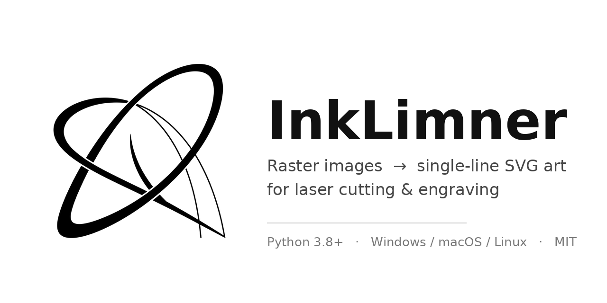

<p align="center">
  
</p>

# InkLimner — Raster-to-SVG Line-Art Converter (v3.4.1.1 · for Laser Cutting)


[](https://github.com/HBrOcean/inklimner/actions/workflows/ci.yml)
[](https://github.com/HBrOcean/inklimner/releases)

Convert common raster images (PNG / JPG / JPEG / BMP / WEBP / TIF / TIFF) into
**pure-stroke, fill-free** SVG vector line art. The output is a **single centerline**
(the laser traces it only once), ready to import into LightBurn, LaserGRBL,
RDWorks, LaserMaker and other laser cutting / engraving software.

> Design goal: turn "one image" into "a ring of cuttable lines" with the simplest
> possible command-line workflow.

> Version note: this is **v3.4.1.1**. The core algorithm is **XDoG line-art + skeleton
> centerline** — the output is a thinned **single-line trace**, ideal for producing
> black-and-white line art. Since v3.4.1.1 a **GUI** ships alongside the CLI.

---

## ✨ Features

- 🎯 **Four extraction modes**
  - `linedraw` — XDoG line art + skeleton centerline (**default**, most like a hand-drawn sketch; the laser traces a single line)
  - `edge` — Canny edges + skeleton centerline (photo tracing)
  - `multi` — grayscale band isolines (clear layering, like a topographic map)
  - `shape` — color-block contours (paper-cut style; can be smoothed via potrace)
- 📱 **EXIF orientation correction**: phone photos are no longer rotated (`--no-exif` to disable)
- 🪄 **Automatic threshold**: `shape` mode uses Otsu's method by default
- 🧹 **Smart cleanup + gap repair**: morphological closing and fragment filtering; endpoints within
  range whose directions line up are **joined automatically** — lines no longer break into pieces
  (`--join-gap`, default `3.0`, `0`=off)
- 📐 **Adjustable smoothing**: Catmull-Rom cubic Bézier smoothing, 0 (crisp polylines) to 1 (smooth curves)
- 📏 **Real-world size**: `--px-per-mm`, or the friendlier `--dpi`, converts to millimeters
- ✂️ **Trim / margin**: `--trim` removes surrounding whitespace; `--margin` adds a border (saves material)
- 📦 **Batch processing**: directories, wildcards, mixed files — run in parallel **processes**
- 🖼️ **Preview for all modes**: `--preview` also emits a PNG preview
- 🇨🇳 **CJK / spaced paths**: handles paths with Chinese characters or spaces
- 🖥️ **No hangs on large images**: `--max-size` auto-downsamples; `--scale` upscales small ones
- 🧮 **Stable physical size**: `--max-size` downsampling is auto-compensated
- 🔒 **Deterministic output**: identical bytes for identical input — friendly to diff / VCS
- ⚡ **Optional potrace acceleration**: smoother `shape` / `multi` contours
- 🖥️ **Graphical interface (Qt / Tkinter)**: visual mode-aware params, live preview, native
  drag & drop — `inklimner_gui.py` picks whichever backend is available (see below)
- 🚀 **Non-zero exit code on failure**: script- and CI-friendly

---

## ⬇️ Download (no Python required)

Don't want to install Python or touch a terminal? Grab a prebuilt package:

👉 **Download from the [Releases page](https://github.com/HBrOcean/inklimner/releases)**

| Download | Best for |
|:--|:--|
| `InkLimner-*-gui.zip` | **Graphical build**: unzip, then double-click `InkLimner(.exe)` |
| `InkLimner-*-cli.zip` | **CLI build**: one self-contained executable, great for scripts |

Built for Windows / macOS / Linux by GitHub Actions. The binaries are unsigned, so the
first launch is stopped once by SmartScreen (Windows) or Gatekeeper (macOS) — just allow
it, as described in [docs/BUILD.md](docs/BUILD.md).

---

## 📦 Installation

Requires **Python 3.8+**.

### Option 1 — single file (simplest)

Just install the dependencies and grab `inklimner.py`:

```bash
pip install opencv-python numpy
```

### Option 2 — pip install (gives you the `inklimner` command)

```bash
pip install .
# then simply:
inklimner --help
```

### Optional dependencies

**Recommended (roughly 100× faster thinning)** — switch OpenCV to the contrib build
(which ships `ximgproc.thinning`):

```bash
pip uninstall opencv-python
pip install opencv-contrib-python
# or: pip install ".[fast]"
```

**Optional (benefits `shape` / `multi` only)** — install
[potrace](http://potrace.sourceforge.net/), **1.9+** required (the `-O` option is used).
Without it, OpenCV contours are used as a fallback.

**Optional (graphical interface)** — for the modern dark UI:

```bash
pip install ".[gui]"          # PySide6 — the Qt interface (recommended)
```
Without it, `inklimner_gui.py` falls back to the zero-dependency Tkinter interface.
For the Tk build you can add Pillow (`pip install ".[tk]"`) for sharper previews,
and tkinterdnd2 (`pip install ".[dnd]"`) for drag & drop.

### Option 3 — Docker

```bash
docker build -t inklimner .
docker run --rm -v "$PWD:/work" inklimner /work/input.png -o /work/output.svg --trim
```

---

## 🚀 Quick Start

```bash
# Simplest usage: default linedraw mode, output next to the source image
python inklimner.py pattern.png
# → creates pattern.svg in the same folder

# Specify the output file name
python inklimner.py pattern.png -o outline.svg

# Convert an entire folder (parallel processes)
python inklimner.py images/ -o out/

# Use a wildcard
python inklimner.py "*.jpg" -o svg_out/

# Phone photo: auto-orient + trace + preview
python inklimner.py photo.jpg --mode edge --preview

# Keep detail in a small image: upscale 2× before processing
python inklimner.py small.png --scale 2 --detail 0.9

# Paper-cut color-block contours (closed paths) + trim whitespace
python inklimner.py logo.png --mode shape --trim --margin 10

# 300 DPI source → millimeter size (two equivalent ways)
python inklimner.py pattern.png --dpi 300
python inklimner.py pattern.png --px-per-mm 11.81
```

---

## 🖥️ Graphical interface

Prefer clicking to typing? Two looks are shipped — the launcher **picks whichever works**:

```bash
python inklimner_gui.py       # run directly (Qt if available, else Tkinter)
python inklimner.py --gui     # or launch it from the CLI
inklimner-gui                 # after pip install
python inklimner_gui.py --qt  # force the Qt build
python inklimner_gui.py --tk  # force the Tkinter build
```

| Interface | Look | Dependency | Notes |
|:--|:--|:--|:--|
| **Qt** (recommended)<br>`inklimner_gui_qt.py` | Modern dark cards, native drag & drop | `pip install "inklimner[gui]"` (PySide6) | Python 3.9+ |
| **Tk**<br>`inklimner_gui_tk.py` | Clean native widgets | **none** (stdlib tkinter) | Python 3.8+ |

Both interfaces are **feature-identical**: they share one spec, one preset list and one
execution path (`inklimner_gui_core.py`), so options can never drift apart.

What it does:

- **Light / dark themes** — **light by default**, switch in the top-right corner; your choice is remembered (preview panes and log colours follow along)
- **Mode-aware controls** — pick `shape` and Canny/band options grey out; only the options that actually apply stay live
- **Presets** — six built-ins (paper-cut, photo trace, hand-drawn line art, stamp, small-image detail, grayscale layers) plus your own saved presets
- **CLI round-trip** — export the current settings as an equivalent `inklimner ...` command, or paste someone's command to refill every option
- **Drag & drop** — drop images or folders onto the window (native in the Qt build; the Tk build needs `pip install "inklimner[dnd]"`)
- **Live preview** — tweak a setting and it re-renders automatically (single small image, 0.4 s debounce)
- **Before / after comparison** — see the source and the result side by side
- **Dual output** — produce a `shape` outline version alongside the current mode in one run
- **Filename template** — e.g. `{name}_cut` → `pattern_cut.svg`
- **Environment bar** — potrace availability and thinning backend at a glance
- **Remembers your setup** — window size, last folders, all options and custom presets in `~/.inklimner_gui.json`

> Tk build on some Linux distros needs the system package: `sudo apt install python3-tk`
> Qt build can render sharper previews with Pillow: `pip install "inklimner[tk]"`

---

## 📖 Detailed Usage

### Command format

```
inklimner <input...> [options]          # after pip install
python inklimner.py <input...> [options]  # running the single file
```

`<input...>` accepts multiple entries: image paths, directories, and wildcards
(`*` `?` `[`) may be mixed freely.

### All options

| Option | Default | Description |
|:---|:---|:---|
| `inputs` | (required) | Image path / directory / wildcard; may be several |
| `-o`, `--output` | auto | Output SVG file (single image) or output directory |
| `--mode` | `linedraw` | `linedraw`=XDoG line art + centerline (recommended); `multi`=grayscale isolines; `shape`=color-block contours; `edge`=Canny + centerline |
| `--detail` | `0.7` | Detail richness 0–1 (linedraw / multi) |
| `--scale` | `1.0` | Upscale factor before processing; 2 is suggested for small images (output coordinates are converted back) |
| `--preview` | off | Also emit a PNG preview (all modes) |
| `--trim` | off | Trim surrounding whitespace (saves material) |
| `--margin` | `0` | Add a white border of N pixels around the result |
| `--max-size` | `2400` | Max longest-edge of the processing resolution; `0`=unlimited |
| `--dilate` | `0` | Line-thickening radius 0–2 (`0`=off) |
| `--min-line-len` | `8` | Minimum centerline length in px |
| `--join-gap` | `3.0` | **Gap repair**: auto-join segment endpoints within this distance (px) when their directions line up; `0`=off (linedraw / edge) |
| `--min-len` | `30` | Minimum closed-contour perimeter (shape / multi without potrace) |
| `--min-band` | `30` | Minimum grayscale-band area (multi) |
| `--band-max` | `200` | multi band coverage ceiling 1–255 (higher keeps more light-gray detail) |
| `--simplify` | `0.001` | Simplification strength; smaller = finer |
| `--smooth` | `0.5` | Smoothing strength 0–1; `0`=polylines |
| `--no-potrace` | off | Force-disable potrace |
| `--turdsize` | `2` | potrace speckle-area threshold; `0`=keep everything |
| `--alphamax` | `1.0` | potrace curve smoothness |
| `--opticurve` | `1` | potrace curve optimization; `1`=on |
| `--opttolerance` | `0.2` | potrace curve optimization tolerance |
| `--threshold` | `auto` | shape-mode binarization threshold 0–255, or `auto` (Otsu) |
| `--invert` | off | Invert black/white (light artwork on dark background) |
| `--no-exif` | off | Do not correct EXIF orientation (correction is on by default) |
| `--canny-low` | `30` | edge-mode low threshold |
| `--canny-high` | `100` | edge-mode high threshold |
| `--blur` | `1` | Pre-blur kernel size; `1`=off (recommended off for linedraw) |
| `--stroke-width` | `0.1` | SVG stroke width (display only — does not affect cutting) |
| `--stroke-color` | `#000000` | SVG stroke color |
| `--px-per-mm` | `0` | Pixels-per-millimeter, e.g. `11.81`=300 DPI; `0`=pixel units |
| `--dpi` | `0` | Convert using DPI (equivalent to `--px-per-mm dpi/25.4`) |
| `-j`, `--jobs` | `0` | Batch worker processes; `0`=auto |
| `-f`, `--force` | on | Overwrite existing outputs (default) |
| `--no-overwrite` | off | Skip files that already exist |
| `-q`, `--quiet` | off | Quiet mode — print errors only |
| `--version` | — | Print the version and exit |

### Output rules

- **Single image + `-o` ending in `.svg`** → writes to that exact file;
- Otherwise → writes into the **directory** given by `-o` (or the source folder), named `original-name.svg`;
- With `--scale`, the output `viewBox` and coordinates are **converted back** to the original size;
- `--trim` / `--margin` change the output canvas size; millimeter size is computed from the final canvas.

---

## 🎨 Choosing Among the Four Modes

### `linedraw` mode (default, most like a hand-drawn sketch)

Uses **XDoG (extended Difference of Gaussians)** to extract line art, closes gaps,
thins to a 1-px skeleton and traces the **centerline** — one single line each.

Best for: photo → hand-drawn line art, illustration tracing, single-line cutting / tracing.

```bash
python inklimner.py pattern.png
python inklimner.py photo.jpg --mode linedraw --detail 0.9 --scale 2
```

### `edge` mode (photos / physical edges)

Uses **Canny** to extract edges, likewise thinned into a centerline.

Best for: tracing photos with clear edges, hard-edged object outlines.

```bash
python inklimner.py photo.jpg --mode edge --canny-low 30 --canny-high 100
```

### `multi` mode (grayscale isolines, clear layering)

Splits grayscale into several **bands** and extracts each band's contours — a look
similar to topographic contour lines. `--band-max` sets the coverage ceiling
(default `200`; set `255` to keep light-gray detail).

Best for: layered shading, gradients, or engraving depth.

```bash
python inklimner.py photo.jpg --mode multi --detail 0.8
python inklimner.py photo.jpg --mode multi --band-max 255   # keep light-gray detail
```

### `shape` mode (color-block contours, paper-cut style)

Binarizes, then extracts **closed contours**; smoother with potrace installed.

Best for: paper-cut, logos, stamps, solid patterns, puppets, silhouettes —
**the go-to mode when you need closed paths to cut through**.

```bash
python inklimner.py logo.png --mode shape --trim
python inklimner.py logo.png --mode shape --threshold 160 --no-potrace
```

---

## 🔧 Tuning Cheat Sheet

| Symptom | Fix |
|:---|:---|
| Jagged edges, burrs | `--blur 3`, or `--simplify 0.003` |
| Many tiny fragments | `--min-line-len 20` (linedraw / edge); `--min-len 60` (shape / multi) |
| Detail lost, shapes rounded | `--detail 0.9` `--simplify 0.0005` `--smooth 0` |
| Noisy background | `--threshold 160` (shape), or adjust `--canny-low/-high` |
| Want crisp polylines | `--smooth 0` |
| Light artwork on dark background not detected | add `--invert` |
| Lines too thin / breaking | `--dilate 1` (or 2) |
| Lines inexplicably cut into pieces | raise `--join-gap 8` first (default 3, up to 20); if still broken, pair with `--dilate 1` |
| Small-image detail mushed | `--scale 2` |
| Large image hangs | `--max-size 1600` |
| Too much whitespace around the result | `--trim` (optionally `--margin 5`) |
| Wrong output size | `--dpi 300` (or `--px-per-mm 11.81`) |
| Photo appears rotated | corrected by default; add `--no-exif` if the file's orientation should be kept |

---

## ⚡ Practical Laser-Cutting Tips

1. **Size conversion**: `--dpi 300` (or `--px-per-mm 11.81`) is easiest; you can also resize in the laser software.
2. **stroke-width affects display only**: the actual kerf is set by laser power / speed / focus.
3. **Centerline vs. closed contour**: `linedraw` / `edge` output **single-line traces** (tracing, single-line cutting); `shape` outputs **closed contours** (cutting along the edge). Pick by purpose.
4. **Trim before cutting**: `--trim` removes dead whitespace, saving material and easing alignment; add `--margin` for a handling border.
5. **Floating thin structures drop out**: ribbons, antennas, twigs, cut-out letters — add "bridges" in Inkscape or delete them.
6. **Be careful with internal holes**: many small closed paths get cut through and are brittle; assign inner detail to an engrave layer.
7. **Layer-based workflow (recommended)**: run the image twice with different modes/parameters, then split into layers in LightBurn.
8. **Downsample large designs first**: control resolution with `--max-size`, then add detail with `--scale`.

---

## ❓ FAQ

**Q: The SVG opens blank after conversion?**
A: Likely light artwork on a dark background. Try `--invert`, or lower `--threshold`; check the extraction with `--preview`.

**Q: Why are there small gaps in the contours?**
A: Raise `--join-gap` first (default `3.0`; try `8`) — endpoints within the gap distance whose
directions line up are joined automatically, so you no longer have to patch lines by hand in
Inkscape. If gaps remain, check whether `--min-line-len` (centerlines) or `--min-len` (closed
contours) is too large, or turn off `--blur`.

**Q: My phone photo is rotated.**
A: Since v3.3 the EXIF orientation is corrected by default. Add `--no-exif` to keep the raw orientation.

**Q: Can colors be preserved?**
A: No. The output is pure stroke line art for cutting. Use Illustrator / Inkscape tracing for color vectors.

**Q: Which input formats are supported?**
A: `.png` `.jpg` `.jpeg` `.bmp` `.webp` `.tif` `.tiff`.

**Q: Why is a large image slow or stuck?**
A: The default `--max-size 2400` already downsamples; lower it to `1600` if needed. Installing `opencv-contrib-python` speeds up thinning by ~100×.

**Q: Is potrace required?**
A: No. It only smooths `shape` / `multi` contours; OpenCV contours are used when absent.

**Q: Is the physical size correct with `--px-per-mm` and `--max-size` together?**
A: Yes — downsampling is auto-compensated.

**Q: Will outputs overwrite files with the same name?**
A: By default yes, with an `[覆盖]` notice. Add `--no-overwrite` to skip existing files.

**Q: Do indexed / palette PNGs cause problems?**
A: No — since v3.2 a palette PNG is decoded as color, so indices are not mistaken for gray.

**Q: How does it differ from potrace / Inkscape tracing?**
A: potrace yields smoother, more faithful curves for fine patterns; this tool is lighter and geared to laser-cutting scenarios (single-line centerline output, fragment filtering, physical size, large-image protection) — out of the box, and can optionally call potrace.

---

## 🖼️ Examples

`examples/` ships a runnable sample:

```bash
python inklimner.py examples/sample.png -o examples/sample_linedraw.svg --trim --preview
python inklimner.py examples/sample.png -o examples/sample_shape.svg --mode shape --trim
```

| File | Description |
|:---|:---|
| `examples/sample.png` | Sample input |
| `examples/sample_linedraw.svg` | linedraw output (centerline art) |
| `examples/sample_shape.svg` | shape output (closed contours) |
| `examples/sample_linedraw.preview.png` | Preview image |

---

## 📁 Project Structure

```
inklimner/
├── inklimner.py                  # main program (single file, easy to ship/package)
├── inklimner_gui.py              # graphical interface launcher (picks Qt / Tk)
├── inklimner_gui_qt.py           # Qt interface (PySide6, modern dark theme)
├── inklimner_gui_tk.py           # Tkinter interface (zero third-party deps)
├── inklimner_gui_core.py         # shared spec & execution used by both interfaces
├── pyproject.toml              # packaging + `inklimner` entry point
├── requirements.txt            # runtime dependencies
├── Makefile                    # common dev commands (make test / make build ...)
├── README.md                   # Chinese README
├── README.en.md                # English README (this file)
├── CHANGELOG.md                # release history
├── CONTRIBUTING.md             # contribution guide
├── LICENSE                     # MIT
├── Dockerfile                  # image with potrace
├── assets/                     # project cover / logo
├── docs/BUILD.md               # cloud-build guide (where the packages come from)
├── docs/releases/              # per-version release notes
├── tools/                      # packaging / smoke-test / version-bump scripts (CI)
├── .github/                    # CI / build workflows + issue / PR templates
├── examples/                   # sample input & outputs
└── tests/                      # pytest tests
```

---

## 🧪 Development & Testing

```bash
pip install -e ".[dev]"      # pytest / ruff / Pillow / PySide6
pytest -q                    # run tests (includes headless Qt build test)
ruff check .                 # lint

# Headless GUI self-check (works on servers / CI too)
QT_QPA_PLATFORM=offscreen python inklimner_gui_qt.py --selftest

# Release helpers (the version string lives in many files — update them at once)
python tools/bump_version.py            # check where the version appears
python tools/bump_version.py 3.4.2      # sync every occurrence in one command
python tools/smoke_test.py              # smoke-test the built executables
```

---

## 📝 License

[MIT License](LICENSE) — free to use, modify, and distribute.
